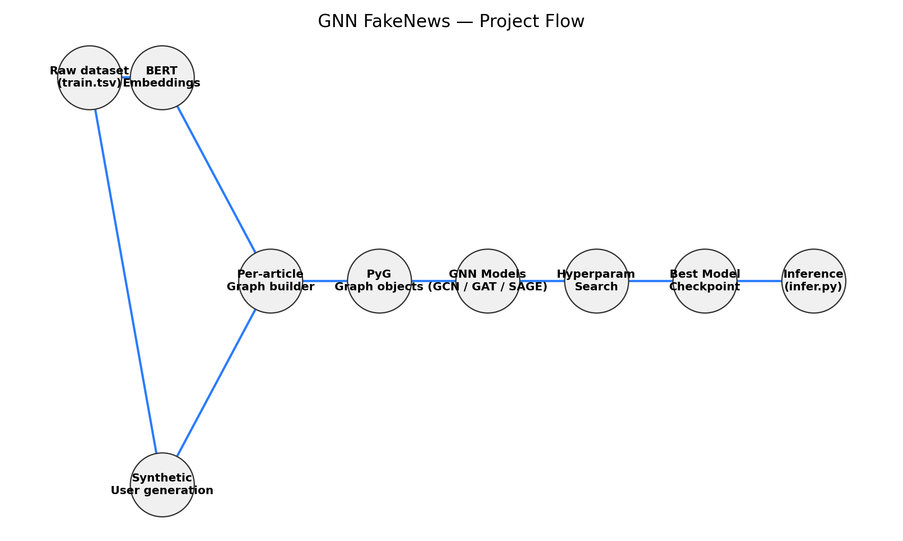
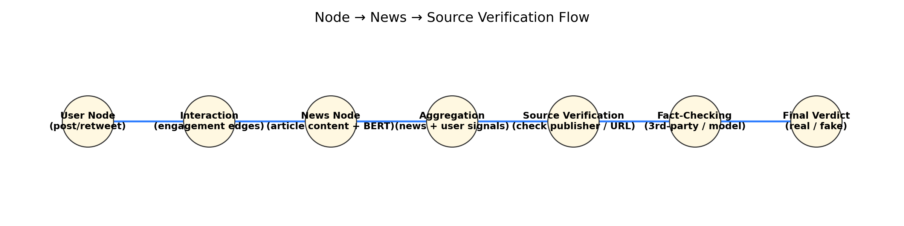

#  GNN Fake News Detection  
**Graph Neural Network (GNN) based Fake News Classification using article content + synthetic social graph signals.**

This project builds a full pipeline from **raw textual news data → graph construction → GNN training → evaluation → deployment**.

It uses **PyTorch Geometric (PyG)** and **BERT embeddings** to classify news articles as **FAKE (1)** or **REAL (0)**.

---

# 1. Project Summary

Traditional text-only fake-news classifiers ignore social context.  

This project builds **a graph per article**, consisting of:
- a **news node** (holds BERT text embedding)
- **synthetic user nodes** interacting with the article
- **user–user edges** generated using a Barabási–Albert (BA) model

We then train GNN models (**GCN**, **GAT**, **GraphSAGE**) for graph-level classification.

The best model is exported and inference-ready.

---

# 2. Architecture Overview

        user_1 ---- user_2 ---- user_3
           \         |         /
            \        |        /
             \       |       /
                (news node)
                      |
          user_4----user_5----user_6


### Node Features  
- **News node** → BERT embeddings (768-dim)  
- **User nodes** → noisy BERT + synthetic profile features  

### Edge Types  
- News → User (interaction)  
- User ↔ User (BA graph link)

---

# 3. Project Flow Diagram

<p align="center">
  
</p>

---

# 4. Node → News → Source Verification Flow

<p align="center">
  
</p>

---

# 5. Dataset → Graph Conversion Pipeline

### Input Features  
Dataset typically includes:
- `title`
- `text`
- `subject`
- `label` (Fake / Real)

### Conversion Steps  

1. Load text → compute **BERT embeddings**  
2. For each article: generate **K synthetic users** (K ~ Poisson(mean=10))  
3. Build **BA user-user graph**  
4. Add **news → user** interaction edges  
5. Save outputs:  
   - `A.txt` (adjacency)  
   - `*.npz` (node features)  
   - `graph_labels.npy`  
   - `node_graph_id.npy`  

---

# 6. Model Training

### GNN Models Used

| Model         | Description                        |
|---------------|------------------------------------|
| **GCN**       | Fast, stable, strong baseline      |
| **GAT**       | Attention across graph edges       |
| **GraphSAGE** | Neighborhood aggregation, scalable |

### Training Details
- Loss: **CrossEntropy**  
- Optimizer: **Adam**  
- Pooling: **Global Mean Pooling**  
- Pipeline:  graphs → DataLoader → GNN → logits → softmax → fake/real


---


# 7. Hyperparameter Search

A grid search was performed over:

Model type: GCN, GAT, GraphSAGE
Learning rate
Hidden dimension
Batch size
Epochs

Results saved in:
hyperparam_runs.csv
hyperparam_runs_sorted.csv

# 8. Repository Structure
````markdown


GNN-Fake-News-Pred/
│
├── notebooks/
│ ├── 01_data_conversion.ipynb
│ ├── 02_graph_generation.ipynb
│ ├── 03_pyg_dataset_build.ipynb
│ ├── 04_gnn_training.ipynb
│ ├── 05_hyperparameter_search.ipynb
│ └── 06_final_evaluation.ipynb
│
├── commit7_final/
│ ├── final_model.pt
│ ├── metadata.json
│ ├── infer.py
│ ├── sample_graph.npz
│ ├── README.md
│ └── model_card.md
│
├── scripts/
│ ├── train.py
│ ├── dataset_utils.py
│ └── inference_utils.py
│
├── data/ # (ignored in repo)
│ ├── node_graph_id.npy
│ ├── new_bert_feature.npz
│ ├── new_profile_feature.npz
│ ├── new_content_feature.npz
│ └── A.txt
│
└── README.md


